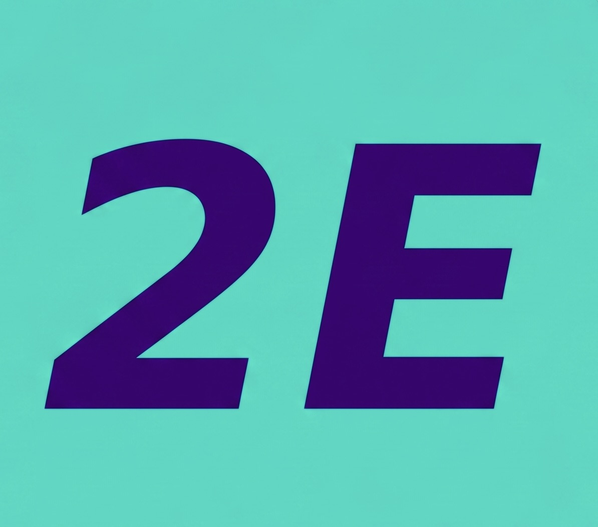

# TEMPLATE — Apunte de Historia (lety2E Apuntes)

Referencia canónica: `apuntes/segunda-guerra-mundial.html`

> Artefacto self-contained: **no depende** de `style.css`, `nav.js` ni `footer.js`.
> Todo el CSS y JS va inline dentro del mismo `.html`.

---

## Checklist para replicar en un tema nuevo

1. Duplicar `apuntes/segunda-guerra-mundial.html` → `apuntes/nombre-del-tema.html`
2. Cambiar `<title>` y `<h1>`
3. Cambiar el subtítulo en `<p>` del header (materia · niveles)
4. Ajustar el color de `.tabs-nav` al tema (ver sección Tabs)
5. Reemplazar el contenido de los niveles 1–4 (mismos componentes, diferente texto)
6. Reemplazar el array `flashcards` (40 pares pregunta/respuesta)
7. Reemplazar el array `quizData` (40 preguntas, 4 opciones cada una)
8. Agregar la card en `apuntes/index.html`

---

## Paleta de colores

```css
--M:       #FF00AA   /* magenta — bordes mini-card, puntos timeline, barra progreso, citas */
--T:       #00DEC8   /* turquesa — h1 header, links, label de respuesta en flashcard */
--P:       #4A0080   /* morado — badges, sec-title, frente flashcard, wm-brand */
--dark:    #1A0828   /* fondo header, cifras, recursos */
--bg:      #E8EEF4   /* azul niebla — fondo de página */
--bg-card: #F4F7FA   /* blanco azulado — mini-cards, quiz */
--txt:     #1e0f2e   /* texto principal */
--txt-2:   #3d2255   /* texto secundario */
```

Regla: nunca usar hex directamente en el HTML, siempre `var(--X)`.

---

## Tipografía

- **Playfair Display Italic 900** — `h1`, `h3` de cards, `.sec-title`, `.cifra .num`, score final
- **DM Sans 300/400/500** — todo lo demás

```html
<link href="https://fonts.googleapis.com/css2?family=Playfair+Display:ital,wght@1,900&family=DM+Sans:wght@300;400;500&display=swap" rel="stylesheet">
```

---

## Estructura del HTML

```
<head>
  Google Fonts
  <style> todos los estilos inline </style>
</head>

<body>
  .watermark              — fijo, esquina superior derecha
  <header .page-header>  — logo + título, fondo --dark
  <nav .tabs-nav>        — botones de nivel (5 tabs)
  5 × <div .tab-content> — uno por nivel
</body>
```

---

## Watermark (esquina superior derecha)

```html
<div class="watermark">
  <span class="wm-brand">lety2E</span>
  <span class="wm-sub">apuntes</span>
</div>
```

- Posición: `fixed`, `top: 0.9rem`, `right: 1.3rem`
- `.wm-brand`: Playfair Italic 900, `color: var(--P)`, 1.9rem, opacidad 82%
- `.wm-sub`: DM Sans caps, 0.68rem, `color: var(--dark)`, opacidad 55%

---

## Header

```html
<header class="page-header">
  <a href="../index.html" class="header-logo-link">
    
  </a>
  <a href="index.html" class="header-section-link">Apuntes</a>
  <div class="header-text">
    <h1>Título del tema</h1>
    <p>Materia · N niveles</p>
  </div>
</header>
```

- Fondo: `var(--dark)`
- Logo → enlace a `../index.html` (inicio del sitio)
- "Apuntes" → enlace a `index.html` (sección Apuntes): Playfair Italic 900, `color: var(--T)`, 1.5rem
- `h1`: Playfair Italic 900, `color: var(--T)`, `clamp(1.6rem, 3.5vw, 2.6rem)`
- `p`: blanco 52% opacidad, 0.78rem

---

## Tabs nav

```html
<nav class="tabs-nav">
  <button class="tab-btn active" onclick="showTab('n1', this)">
    <span class="zoom-label">zoom ×1</span>Panorama
  </button>
  <button class="tab-btn" onclick="showTab('n2', this)">
    <span class="zoom-label">zoom ×2</span>Causas
  </button>
  <!-- repetir para cada nivel -->
</nav>
```

- Fondo: `#3D4A1E` (verde olivo militar) — **cambiar por el color del tema si no es historia**
- Borde inferior: 2px, turquesa 20% opacidad
- Tab activo: texto blanco + borde inferior `var(--M)`
- Tab inactivo: blanco 38% opacidad
- `.zoom-label`: turquesa, 0.6rem, indica el nivel de profundidad

---

## Componentes de contenido (niveles 1–4)

Cada nivel es `<div id="nX" class="tab-content">`. El primero lleva `class="tab-content active"`.

### `.level-badge`
```html
<div class="level-badge">◎ Nivel 1 — Panorama general</div>
```
Pastilla morada (`var(--P)`), letras blancas, 0.65rem. Va al inicio de cada tab.

---

### `.mini-grid` + `.mini-card`
```html
<div class="mini-grid">
  <div class="mini-card" style="--accent: var(--M)">
    <span class="card-tag">Etiqueta</span>
    <h3>Título</h3>
    <p>Descripción corta.</p>
  </div>
</div>
```
- Grid: `auto-fit, minmax(195px, 1fr)`
- `--accent` rota entre `var(--M)`, `var(--T)`, `var(--P)`
- `.card-tag`: 0.62rem caps, hereda `--accent`
- `h3`: Playfair Italic, `var(--dark)`

---

### `.sec-title`
```html
<h2 class="sec-title">Nombre de la sección</h2>
```
Playfair Italic, `var(--P)`, 1.3rem. Borde inferior morado 20% opacidad. Separa bloques dentro de un nivel.

---

### `.reveal-btn` + `.reveal-content`
```html
<button class="reveal-btn" onclick="toggleReveal(this)">
  <span class="reveal-icon">+</span> Texto del botón
</button>
<div class="reveal-content">
  <div class="reveal-card">Contenido con <strong>énfasis</strong>.</div>
</div>
```
- Botón dashed turquesa; `.reveal-icon` rota 45° al abrirse
- `.reveal-card`: fondo morado 6% opacidad, borde morado suave

---

### `.timeline` + `.tl-item`
```html
<div class="timeline">
  <div class="tl-item">
    <span class="tl-date">1939</span>
    <span class="tl-text">Descripción del evento.</span>
  </div>
</div>
```
- Línea izquierda: morado 20% · Punto: `var(--M)` magenta
- Fecha: magenta, 0.72rem, `min-width: 62px`

---

### `.bandos-grid` + `.bando-card`
```html
<div class="bandos-grid">
  <div class="bando-card" style="--accent: var(--T)">
    <h4>Grupo A</h4>
    <ul><li>Elemento</li></ul>
  </div>
  <div class="bando-card" style="--accent: var(--M)">
    <h4>Grupo B</h4>
    <ul><li>Elemento</li></ul>
  </div>
</div>
```
Grid 2 columnas. Borde superior con `--accent`. Ideal para comparar dos grupos, bandos, posturas.

---

### `.cifra-row` + `.cifra`
```html
<div class="cifra-row">
  <div class="cifra">
    <span class="num">70M+</span>
    <span class="label">Descripción</span>
  </div>
</div>
```
Fondo `var(--dark)`. Número en Playfair magenta. Grid `auto-fit, minmax(128px, 1fr)`.

---

### `.quote-block`
```html
<div class="quote-block">
  <p>"Texto de la cita."</p>
  <cite>— Autor</cite>
</div>
```
Borde izquierdo magenta, fondo magenta 6% opacidad.

---

### `.recursos`
```html
<div class="recursos">
  <h4>PARA SABER MÁS</h4>
  <ul>
    <li>Libro, documental o recurso</li>
  </ul>
</div>
```
Caja oscura (`var(--dark)`). Título en turquesa. Va al final del último nivel de contenido.

---

## Nivel 5 — Actividad interactiva

### Flashcards

Array de datos:
```javascript
const flashcards = [
  { q: 'Pregunta', a: 'Respuesta con <strong>énfasis</strong> opcional.' },
  // 40 entradas
];
```

- **Frente** (`.fc-front`): fondo `var(--P)`, texto `#E2D4FF` lavanda
- **Reverso** (`.fc-back`): fondo `var(--bg-card)`, label "Respuesta" en `var(--M)`
- Flip 3D: `transform: rotateY(180deg)` con `perspective: 1000px`
- Controles: botones `←` `→`, contador `X de N`, botón mezclar
- Barra de progreso: gradiente `var(--M) → var(--T)`

### Quiz

Array de datos:
```javascript
const quizData = [
  {
    q: 'Pregunta',
    opts: ['Opción A', 'Opción B', 'Opción C', 'Opción D'],
    correct: 1,   // índice 0-3
    fb: 'Feedback que aparece al responder.'
  },
  // 40 entradas
];
```

- Correcta: fondo turquesa · Incorrecta: fondo magenta
- Score final: `X/40` en Playfair magenta, 2.5rem

---

## JavaScript — funciones clave

| Función | Qué hace |
|---|---|
| `showTab(id, btn)` | Activa el tab, desactiva los demás |
| `toggleReveal(btn)` | Abre/cierra `.reveal-content` con animación |
| `fcFlip()` | Voltea la flashcard (toggle `.flipped`) |
| `fcNav(dir)` | Navega entre flashcards (+1 / -1) |
| `fcShuffle()` | Mezcla el mazo con Fisher-Yates |
| `fcRender()` | Actualiza pregunta, respuesta, contador y barra |
| `quizAnswer(idx)` | Evalúa respuesta, aplica estilos correcto/incorrecto |
| `nextQuestion()` | Avanza al siguiente quiz |
| `restartQuiz()` | Reinicia el quiz desde cero |

El CSS y el JS **no cambian** entre temas. Solo cambia el contenido (textos, arrays).

---

## Responsive

```css
@media (max-width: 580px) {
  .bandos-grid { grid-template-columns: 1fr; }
  .tab-btn     { min-width: 80px; font-size: 0.72rem; }
  .fc-card     { height: 210px; }
}
```

---

## Card en `apuntes/index.html`

Al agregar el apunte al grid, usar este patrón:

```html
<a class="apunte-card" href="nombre-del-tema.html" style="--card-accent: var(--M);">
  <span class="apunte-tipo">artefacto</span>
  <h3>Nombre del tema</h3>
  <p class="apunte-hint">Descripción breve de lo que cubre.</p>
</a>
```

`--card-accent` rota entre `var(--M)`, `var(--T)`, `var(--P)` para variedad visual.
