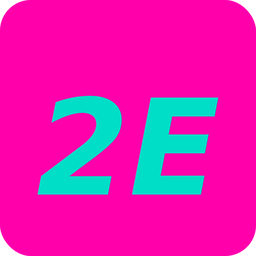

# Estructura: Apunte de Historia (formato paquetito)
Referencia canónica: `pruebas/segunda-guerra-mundial.html`

---

## Paleta de colores

```
--M:       #FF00AA   magenta — bordes de cards, puntos de timeline, barra progreso
--T:       #00DEC8   turquesa — título h1, links, label de respuesta, borde tabs
--P:       #4A0080   morado — badges, section titles, frente de flashcard
--dark:    #1A0828   negro-morado — header, cifras, recursos
--bg:      #E8EEF4   azul niebla — fondo de página
--bg-card: #F4F7FA   blanco azulado — fondo de mini-cards y quiz
--txt:     #1e0f2e   texto principal
--txt-2:   #3d2255   texto secundario
```

---

## Tipografía

- **Playfair Display Italic 900** — títulos de cards (`h3`), section titles, score final
- **DM Sans 300/400/500** — todo lo demás, incluyendo preguntas de flashcard

Importadas vía Google Fonts:
```html
<link href="https://fonts.googleapis.com/css2?family=Playfair+Display:ital,wght@1,900&family=DM+Sans:wght@300;400;500&display=swap" rel="stylesheet">
```

---

## Arquitectura del HTML

```
<head>
  Google Fonts (Playfair + DM Sans)
  <style> todos los estilos inline </style>
</head>

<body>
  .watermark            (fijo, esquina sup-derecha)
  <header .page-header> (flex, fondo --dark)
  <nav .tabs-nav>       (5 tabs, fondo verde militar)
  5 × <div .tab-content>
```

---

## Header

```html
<header class="page-header">
  
  <div class="header-text">
    <h1>Título del tema</h1>
    <p>Subtítulo · N niveles</p>
  </div>
</header>
```

- Fondo: `var(--dark)`
- Logo: `icono-2e.png` (fondo magenta, "2E" turquesa), alineado a la izquierda
- `h1`: Playfair Italic, color `var(--T)` turquesa
- `p`: blanco 52% opacidad

---

## Tabs nav

```html
<nav class="tabs-nav">
  <button class="tab-btn active" onclick="showTab('n1', this)">
    <span class="zoom-label">zoom ×1</span>Panorama
  </button>
  <!-- repetir por cada nivel -->
</nav>
```

- Fondo: `#3D4A1E` (verde olivo militar oscuro)
- Borde inferior: turquesa 20% opacidad
- Tab activo: texto blanco + borde inferior magenta
- Tab inactivo: blanco 38% opacidad

---

## Tabs de contenido (niveles 1–4)

Cada `<div id="nX" class="tab-content">` contiene una combinación de estos bloques:

### `.level-badge`
Pastilla morada con el número de nivel. Va al inicio de cada tab.

```html
<div class="level-badge">◎ Nivel 1 — Panorama general</div>
```

### `.mini-grid` + `.mini-card`
Grid responsive (`auto-fit, minmax(195px, 1fr)`).

```html
<div class="mini-grid">
  <div class="mini-card" style="--accent: var(--M)">
    <span class="card-tag">Etiqueta</span>
    <h3>Título</h3>
    <p>Descripción corta.</p>
  </div>
</div>
```

- `--accent` rota entre `var(--M)`, `var(--T)`, `var(--P)`
- `.card-tag` hereda el color del `--accent`

### `.reveal-btn` + `.reveal-content`
Botón dashed turquesa que despliega contenido oculto.

```html
<button class="reveal-btn" onclick="toggleReveal(this)">
  <span class="reveal-icon">+</span> Texto del botón
</button>
<div class="reveal-content">
  <div class="reveal-card">Contenido oculto con <strong>énfasis</strong>.</div>
</div>
```

### `.sec-title`
Separador de sección: Playfair Italic morado, borde inferior sutil.

```html
<h2 class="sec-title">Nombre de la sección</h2>
```

### `.timeline` + `.tl-item`
Línea del tiempo vertical.

```html
<div class="timeline">
  <div class="tl-item">
    <span class="tl-date">1939</span>
    <span class="tl-text">Descripción del evento.</span>
  </div>
</div>
```

- Línea izquierda morada · Punto magenta · Fecha en magenta mín 62px

### `.bandos-grid` + `.bando-card`
Grid 2 columnas para comparar dos grupos.

```html
<div class="bandos-grid">
  <div class="bando-card" style="--accent: var(--T)">
    <h4>Grupo A</h4>
    <ul><li>Elemento</li></ul>
  </div>
  <div class="bando-card" style="--accent: var(--M)">
    <h4>Grupo B</h4>
    <ul><li>Elemento</li></ul>
  </div>
</div>
```

### `.cifra-row` + `.cifra`
Estadísticas destacadas sobre fondo oscuro.

```html
<div class="cifra-row">
  <div class="cifra">
    <span class="num">70M+</span>
    <span class="label">Descripción</span>
  </div>
</div>
```

### `.quote-block`
Cita con borde magenta.

```html
<div class="quote-block">
  <p>"Texto de la cita."</p>
  <cite>— Autor</cite>
</div>
```

### `.recursos`
Caja oscura de referencias al final del nivel 4.

```html
<div class="recursos">
  <h4>PARA SABER MÁS</h4>
  <ul>
    <li>Libro, película o recurso</li>
  </ul>
</div>
```

---

## Nivel 5 — Actividad (Flashcards + Quiz)

### Flashcards

```html
<div class="fc-scene">
  <div class="fc-card" id="fc-card" onclick="fcFlip()">
    <div class="fc-face fc-front">
      <span class="fc-label">Pregunta — toca para ver la respuesta</span>
      <p class="fc-question" id="fc-question"></p>
    </div>
    <div class="fc-face fc-back">
      <span class="fc-answer-label">Respuesta</span>
      <p class="fc-answer" id="fc-answer"></p>
    </div>
  </div>
</div>
```

- **Frente** (`.fc-front`): fondo `var(--P)` morado · texto `#E2D4FF` lavanda suave
- **Reverso** (`.fc-back`): fondo `--bg-card` · texto normal
- Pregunta: DM Sans 500 — más fácil de leer
- Label de respuesta: caps, color `--M` magenta
- Flip 3D con `transform: rotateY(180deg)`

Array de datos:
```javascript
const flashcards = [
  { q: 'Pregunta', a: 'Respuesta con <strong>énfasis</strong> opcional.' },
  // ... 40 entradas
];
```

Controles: `←` `→`, contador `X de N`, botón mezclar (Fisher-Yates shuffle).
Barra de progreso: gradiente `--M → --T`, ancho en `%` según índice.

### Quiz

```javascript
const quizData = [
  {
    q: 'Pregunta',
    opts: ['Opción A', 'Opción B', 'Opción C', 'Opción D'],
    correct: 1,       // índice 0-3 de la respuesta correcta
    fb: 'Feedback explicativo que aparece al responder.'
  },
  // ... 40 entradas
];
```

- Correcta → fondo turquesa
- Incorrecta → fondo magenta
- Score final: `X/40` en Playfair magenta grande

---

## JavaScript — funciones clave

| Función | Qué hace |
|---------|----------|
| `showTab(id, btn)` | Activa el tab seleccionado, desactiva los demás |
| `toggleReveal(btn)` | Abre/cierra bloques `.reveal-content` con animación |
| `fcFlip()` | Voltea la flashcard (toggle clase `.flipped`) |
| `fcNav(dir)` | Navega entre flashcards (+1 / -1) |
| `fcShuffle()` | Mezcla el mazo con Fisher-Yates |
| `fcRender()` | Actualiza pregunta, respuesta, contador y barra de progreso |
| `quizAnswer(idx)` | Evalúa respuesta, aplica estilos correcto/incorrecto |
| `nextQuestion()` | Avanza al siguiente quiz |
| `restartQuiz()` | Reinicia el quiz desde cero |

---

## Watermark fijo

```html
<div class="watermark">
  <span class="wm-brand">lety2E</span>
  <span class="wm-sub">apuntes</span>
</div>
```

- Posición: `fixed`, esquina superior derecha
- `.wm-brand`: Playfair Italic 900, magenta, 1.9rem, opacidad 82%
- `.wm-sub`: DM Sans caps, 0.68rem, oscuro 55%

---

## Responsive

```css
@media (max-width: 580px) {
  .bandos-grid { grid-template-columns: 1fr; }
  .tab-btn     { min-width: 80px; font-size: 0.72rem; }
  .fc-card     { height: 210px; }
}
```

---

## Para replicar en otro tema

1. Duplicar `segunda-guerra-mundial.html`
2. Cambiar el `<title>` y el `<h1>`
3. Reemplazar el contenido de los niveles 1–4 (mismos componentes, diferente texto)
4. Reemplazar el array `flashcards` (40 pares pregunta/respuesta)
5. Reemplazar el array `quizData` (40 preguntas con 4 opciones cada una)
6. El CSS y el JS no cambian
